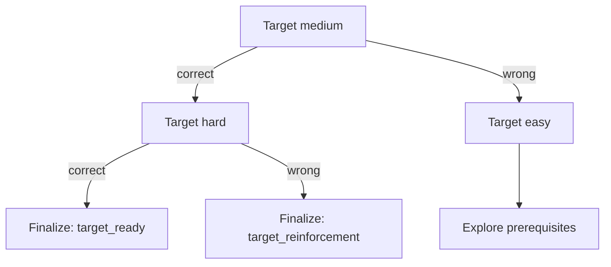
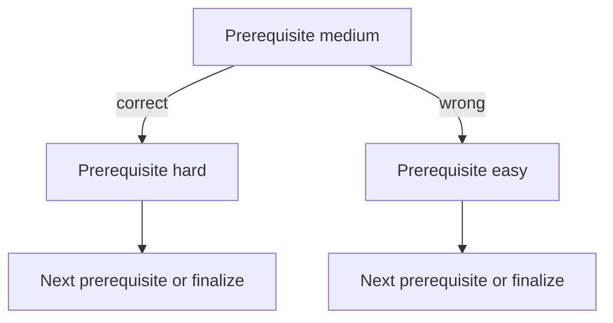
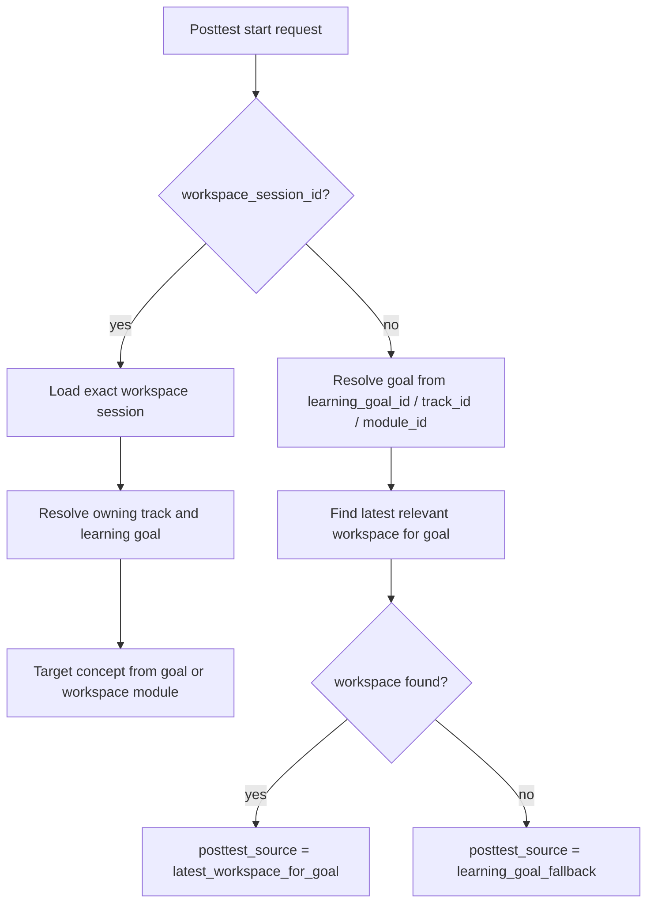
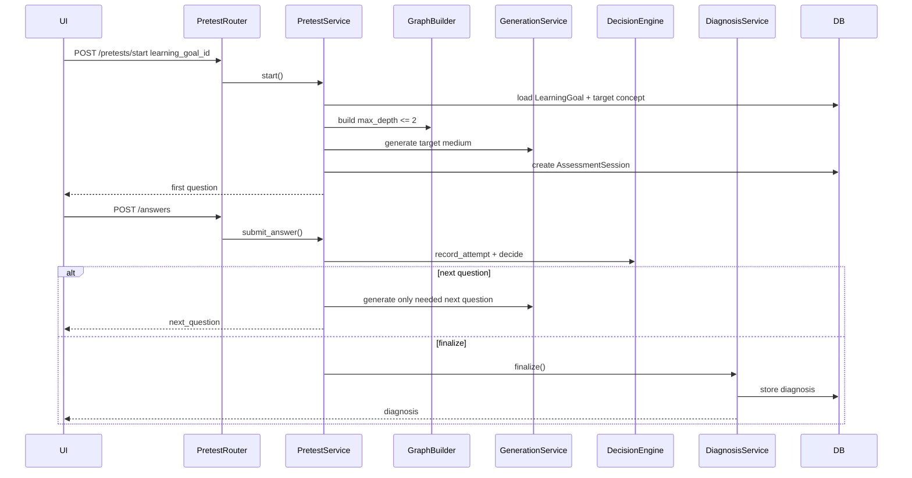
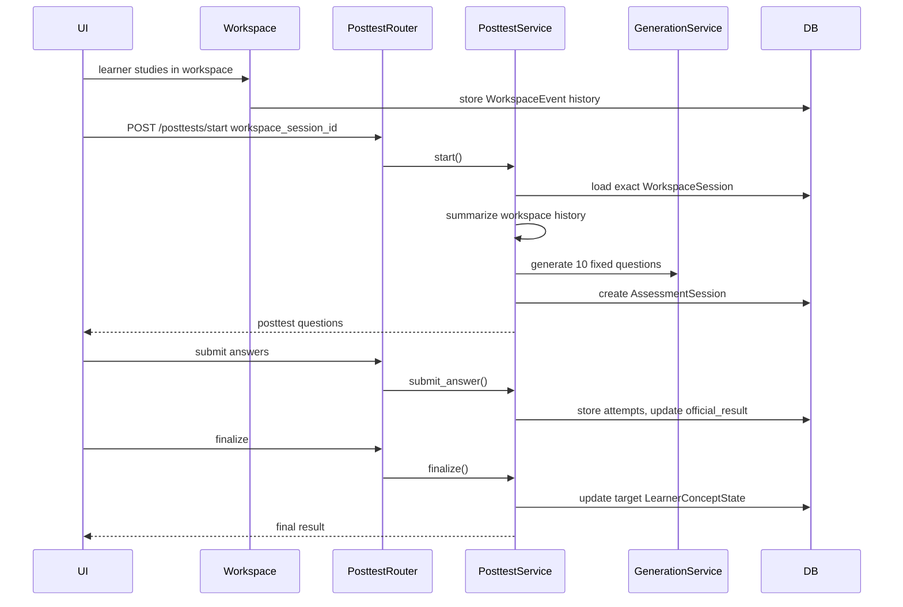

# Adaptive Assessment Architecture

Status: current architecture after adaptive pretest/posttest responsibility split.

Scope:
- Backend pretest module
- Backend posttest module
- Shared question generation and evidence metrics
- Minimal frontend integration points
- Known remaining coupling and review risks

This document is intentionally analytical. It describes how the current code behaves, which modules own which responsibilities, and where the architecture still has ambiguity.

---

## 1. High-Level Responsibility Boundary

The intended architecture separates three product modules:

| Module | Current responsibility | Should not own |
|---|---|---|
| Pretest | Standalone diagnostic baseline for selected learning goal | Workspace creation, remediation session goal creation, posttest scope |
| Workspace | Actual learning/chat/material/practice history | Dependency on pretest parameters |
| Posttest | Fixed mastery check after workspace learning | Pretest remediation traversal |

Current backend implementation is mostly aligned:

- Pretest no longer creates workspace/track/remediation goals.
- Posttest no longer selects scope from pretest diagnosis nodes.
- Posttest primarily uses workspace history summary, then falls back to selected goal concept.
- Official posttest score is pure MCQ only.

Remaining architectural drift:

- Dashboard/report modules still consume diagnosis shape and some old metric names.
- Legacy goal statuses such as `pretest_in_progress` and `diagnosed` still exist in models/services for backward compatibility, but pretest no longer writes them.

---

## 2. Backend File Map

### Pretest

| File | Role |
|---|---|
| `app/modules/pretests/router.py` | HTTP endpoints for start/read/answer/finalize |
| `app/modules/pretests/adaptive_service.py` | Pretest session lifecycle, lazy question generation, answer handling |
| `app/modules/pretests/decision_engine.py` | Adaptive branching logic |
| `app/modules/pretests/graph_scope_builder.py` | Target/prerequisite graph scope and priority queue |
| `app/modules/pretests/diagnosis_service.py` | Converts attempts into diagnostic report |
| `app/modules/pretests/generation_service.py` | Shared fresh question generation for pretest and posttest |
| `app/modules/pretests/question_validator.py` | Question schema and difficulty quality validation |
| `app/modules/pretests/evidence_evaluator.py` | Thin subclass of shared assessment evaluator |

### Posttest

| File | Role |
|---|---|
| `app/modules/posttests/router.py` | HTTP endpoints for start/read/answer/finalize |
| `app/modules/posttests/schemas.py` | Request/response contracts |
| `app/modules/posttests/service.py` | Posttest source resolution, workspace summary, fixed generation, scoring, mastery update |

### Shared / adjacent

| File | Role |
|---|---|
| `app/modules/assessments/metrics.py` | MCQ/reasoning/canvas evidence evaluator |
| `app/modules/learning/service.py` | Dashboard/report aggregation reads pretest/posttest outputs |
| `app/modules/tracks/path_builder.py` | Legacy-compatible path builder; now builds from selected goal target, not pretest diagnosis |
| `app/modules/workspaces/models.py` | WorkspaceSession and WorkspaceEvent read by posttest |

---

## 3. Pretest Architecture

### 3.1 Entry Points

`app/modules/pretests/router.py`

| Endpoint | Purpose |
|---|---|
| `POST /api/v1/pretests/start` | Create or resume active adaptive pretest |
| `GET /api/v1/pretests/{session_id}` | Read active pretest |
| `POST /api/v1/pretests/{session_id}/answers` | Submit answer and receive next question or diagnosis |
| `POST /api/v1/pretests/{session_id}/finalize` | Manual finalize |

Router still contains legacy fallback behavior for old pretest sessions:

```text
if AssessmentSession.metadata_json["generation"] is not adaptive:
    delegate to legacy_learning_service
```

Adaptive generations currently recognized:

```text
lazy_node_pack
fresh_ai_questions
```

### 3.2 Start Flow

Main owner: `AdaptivePretestService.start`

Current flow:

1. Check active pretest for same learning goal.
2. Load `LearningGoal`.
3. Reject inactive archived/cancelled goals.
4. Load target `KnowledgeConcept`.
5. Clamp requested graph depth:

```python
effective_depth = min(int(depth), 2)
```

6. Build graph scope with max depth 2.
7. Create `AssessmentSession`:
   - `session_type = "pretest"`
   - `source = "adaptive_generated"`
   - `max_depth = effective_depth`
   - `max_questions = payload.max_questions`
   - `max_nodes_visited = payload.max_nodes_visited`
8. Generate one target node question pack:
   - `easy`
   - target concept
   - `medium`
   - `hard`
9. Initialize `decision_state_json`.
10. Commit assessment state without changing `LearningGoal.status`.

Important current behavior:

- First displayed question is always target medium.
- The target node already has easy/medium/hard stored so the same node never needs another model call.
- Pretest does not generate all node questions upfront.
- `max_questions` is only a hard upper bound / safety cap. It is not the desired number of pretest questions.
- Best-case pretest should end after 2 questions: target medium + target hard.
- Because each visited node shows at most 2 questions, effective `max_nodes_visited` is clamped to `max_questions // 2`; default 10 questions means at most 5 nodes.
- Pretest status is tracked on `AssessmentSession`, not by changing `LearningGoal.status`.

### 3.3 Pretest Decision State

Stored in `AssessmentSession.decision_state_json`.

Important keys:

```json
{
  "target_concept_code": "...",
  "current_concept_code": "...",
  "current_difficulty": "medium",
  "current_question_id": "...",
  "question_count": 1,
  "max_questions": 10,
  "max_depth": 2,
  "max_nodes_visited": 5,
  "max_questions_per_node": 2,
  "confidence_threshold": 0.95,
  "probe_queue": [],
  "generated_packs": {},
  "generated_questions": {
    "target_code": {
      "easy": "question_id",
      "medium": "question_id",
      "hard": "question_id"
    }
  },
  "node_results": {},
  "confidence": 0.0,
  "stop_reason": null
}
```

Notes:

- `max_questions` is a cap. The decision engine must not try to fill it.
- `generated_packs` is now largely legacy naming; current fresh flow stores generated question IDs by concept/difficulty.
- `generated_questions` grows lazily per concept, but each visited concept stores easy/medium/hard together.
- `probe_queue` contains prerequisite candidates only within graph scope.

### 3.4 Graph Scope

Owner: `GraphScopeBuilder`

The graph scope is prerequisite-direction traversal:

```text
target concept
<- prerequisite depth 1
<- prerequisite depth 2
```

Current max depth:

```text
<= 2
```

Graph scope shape:

```json
{
  "target": "multiplication",
  "target_concept_id": "...",
  "subject_code": "math",
  "max_depth": 2,
  "nodes": [
    {
      "concept_id": "...",
      "concept_code": "multiplication",
      "title": "Multiplication",
      "description": "...",
      "depth": 0,
      "role": "target",
      "parent": null
    }
  ],
  "edges": [
    {
      "from": "multiplication",
      "to": "addition",
      "edge_type": "prerequisite",
      "weight": 1.0,
      "depth": 1
    }
  ]
}
```

Probe queue priority:

```python
priority = edge_weight - (depth * 0.2)
```

Sort order:

```text
priority desc, depth asc, concept_code asc
```

Architectural implication:

- Higher edge weight wins.
- Shallower prerequisites are preferred.
- Ties are deterministic by concept code.
- Historical weakness is not currently included in this queue.

### 3.5 Adaptive Branching

Owner: `PretestDecisionEngine`

Target node:



Critical target invariant:

```text
target medium correct -> target hard correct -> finalize target_ready
target medium correct -> target hard wrong   -> finalize target_reinforcement
target medium wrong   -> target easy correct -> next prerequisite node
target medium wrong   -> target easy wrong   -> next prerequisite node
```

The following behavior is incorrect:

```text
target medium correct -> target hard -> continue to prerequisites
target medium correct -> keep generating until max_questions
pretest always tries to ask 10 questions
```

Pretest expected question count:

| Case | Expected count |
|---|---:|
| Target ready | 2 questions |
| Target reinforcement | 2 questions |
| Target fragile/gap | 2 questions on target, then prerequisite probes |
| Deep prerequisite diagnosis | Up to `max_questions` only if needed |

Prerequisite node:



Limit checks happen before branching:

```python
if question_count >= max_questions:
    finalize max_questions_reached
```

This limit is only a stop condition. It is not a generation target.

Node visit limit:

```python
effective_max_nodes_visited = min(requested_max_nodes_visited, max_questions // 2)
if len(visited) >= effective_max_nodes_visited:
    finalize max_nodes_visited
```

Current node statuses:

| Pattern | Status |
|---|---|
| medium correct + hard correct | `ready` |
| medium correct + hard wrong | `partial` |
| medium wrong + easy correct | `fragile` |
| medium wrong + easy wrong | `gap` |
| medium correct only | `probably_ready` |
| medium wrong only | `probably_gap` |
| no attempt | `not_asked` |

### 3.6 Answer Evaluation

Owner: shared `AssessmentEvidenceEvaluator`

Official correctness is anchored on selected option:

```python
is_correct = selected_option.is_correct
answer_score = 1.0 if is_correct else 0.0
```

Evidence is diagnostic:

- `reasoning_score`
- `canvas_score`
- `evidence_score`
- `diagnostic_signal`
- `confidence`

Canvas behavior:

- If canvas asset exists: `stored_not_evaluated`
- If canvas used but not uploaded: `client_canvas_not_uploaded`
- No vision scoring currently changes official result.

### 3.7 Diagnosis Output

Owner: `PretestDiagnosisService.finalize`

Diagnosis shape:

```json
{
  "summary": "...",
  "target": {},
  "nodes": [],
  "analysis": {},
  "stop_reason": "...",
  "score_percent": 90,
  "confidence_percent": 68,
  "overall_mastery_percent": 72,
  "recommended_path": "review_only",
  "path_options": []
}
```

Stored in:

- `AssessmentSession.metadata_json["diagnosis"]`
- `LearningGoal.metadata_json["diagnosis"]`

Current side effects:

- `assessment.status = "completed"`
- `AssessmentSession.metadata_json["diagnosis"]` is updated
- `LearningGoal.metadata_json["diagnosis"]` is optionally updated for report/history

Architectural boundary:

Pretest does not update `LearnerConceptState`, curriculum mastery, workspace path, track modules, or `LearningGoal.status`. Only posttest finalize updates mastery state.

---

## 4. Posttest Architecture

### 4.1 Entry Points

`app/modules/posttests/router.py`

| Endpoint | Purpose |
|---|---|
| `POST /api/v1/posttests/start` | Create/read active posttest |
| `GET /api/v1/posttests/{session_id}` | Read posttest |
| `POST /api/v1/posttests/{session_id}/answers` | Submit answer |
| `POST /api/v1/posttests/{session_id}/finalize` | Finalize and update mastery |

### 4.2 Start Request

Schema: `PosttestStartRequest`

Accepted identifiers:

```json
{
  "workspace_session_id": "optional",
  "learning_goal_id": "optional",
  "track_id": "optional",
  "module_id": "optional"
}
```

Validation:

```text
At least one of workspace_session_id, learning_goal_id, track_id, module_id is required.
```

Preferred input:

1. `workspace_session_id`
2. `learning_goal_id`
3. `track_id` / `module_id` fallback path

### 4.3 Posttest Source Resolution

Owner: `_resolve_posttest_context`

Resolution logic:



Source labels:

| Source | Meaning |
|---|---|
| `workspace_session` | Exact requested workspace session |
| `latest_workspace_for_goal` | Latest active/completed workspace for goal |
| `learning_goal_fallback` | No workspace history; target concept only |

Validation when exact workspace is provided:

- Must belong to current user.
- Optional `track_id` must match.
- Optional `module_id` must match.
- Optional `learning_goal_id` must match.

### 4.4 Workspace Learning Summary

Owner: `_workspace_learning_summary`

Purpose:

- Avoid sending raw full chat history to LLM.
- Convert workspace history into compact posttest context.
- Store source explanation in posttest metadata.

Summary shape:

```json
{
  "posttest_source": "workspace_session",
  "workspace_session_id": "...",
  "learning_goal_id": "...",
  "selected_learning_goal": "...",
  "target_concept": {
    "concept_id": "...",
    "concept_code": "...",
    "title": "...",
    "description": "..."
  },
  "concepts_covered": [],
  "explanations_and_materials": [],
  "examples_discussed": [],
  "practice_questions_attempted": [],
  "mistakes_or_misconceptions": [],
  "materials_shown": [],
  "final_workspace_summary": {},
  "learner_language": "id",
  "learner_level": {
    "education_level": "...",
    "grade_level": "..."
  },
  "compact_transcript": "...",
  "summary_quality": "workspace_history"
}
```

Text limit:

```text
WORKSPACE_SUMMARY_TEXT_LIMIT = 5000
```

If no text/quiz/media events exist:

```text
summary_quality = fallback_target_concept
posttest_source = learning_goal_fallback
compact_transcript = ""
```

### 4.5 Posttest Generation

Owner: `AdaptivePosttestService.start`

Fixed difficulty sequence:

```python
POSTTEST_DIFFICULTIES = (
    "medium",
    "medium",
    "medium",
    "hard",
    "hard",
    "hard",
    "hard",
    "hard",
    "hard",
    "hard",
)
```

Current generation:

- exactly one target concept
- exactly 10 questions
- 3 medium
- 7 hard
- `assessment_type = "posttest"`
- `node_role = "goal"`
- `diagnosis_context = compact workspace summary`

Important:

Despite the parameter name `diagnosis_context`, posttest passes workspace summary into it. The prompt explicitly says not to use pretest diagnosis as scope.

### 4.6 Posttest Decision State

Stored in `AssessmentSession.decision_state_json`.

Shape:

```json
{
  "question_queue": ["q1", "q2"],
  "current_index": 0,
  "official_result": {
    "answered_count": 0,
    "total_questions": 10,
    "correct_count": 0,
    "pure_answer_percent": 0.0,
    "official_scaled_score": 0.0,
    "official_pass": false,
    "metric_source": "official_mcq"
  },
  "node_results": {
    "target_concept_code": {
      "concept_id": "...",
      "concept_title": "...",
      "total_questions": 10,
      "answered_count": 0,
      "correct_count": 0,
      "answer_score_sum": 0.0,
      "evidence_score_sum": 0.0,
      "confidence_sum": 0.0,
      "answer_percent": 0.0,
      "evidence_percent": 0.0,
      "score_percent": 0.0,
      "confidence_percent": 0.0,
      "scaled_score": 0.0,
      "passed": false,
      "retake_required": true,
      "metric_source": "official_mcq",
      "attempts": []
    }
  }
}
```

Note:

The API still uses `node_results`, but posttest now has only one target concept node.

### 4.7 Posttest Answer Flow

Owner: `AdaptivePosttestService.submit_answer`

Current behavior:

1. Load assessment.
2. Validate session active.
3. Load question.
4. Reject duplicate attempt.
5. Validate selected option.
6. Evaluate answer with pure MCQ logic.
8. Save `AssessmentAttempt`.
9. Record MCQ and evidence into target node state.
10. Refresh official result from target node state.
11. Advance `current_index`.

Official correctness:

```python
is_correct = selected_option.is_correct
answer_score = 1.0 if correct else 0.0
```

Diagnostic evidence:

- Posttest UI does not collect reasoning/canvas.
- Legacy reasoning/canvas request fields are ignored by backend.
- Posttest official result is pure MCQ only.

### 4.8 Posttest Finalize Flow

Owner: `AdaptivePosttestService.finalize`

Current behavior:

1. Load assessment.
2. Load target node result.
3. Recalculate official score.
4. If official pass, upsert `LearnerConceptState` for target concept.
5. If pass:
   - status `mastered`
   - next review in 7 days
6. If fail:
   - do not update mastery state
7. Store:
   - `posttest_finalized_at`
   - `node_results`
   - `official_result`
   - `recommended_next_step`
8. If learning goal is `in_progress` and posttest passed:
   - mark goal `completed`

Important:

- Mastery update only applies to selected target concept.
- It does not update pretest remediation prerequisite nodes.
- Pass/fail is aggregate MCQ for the 10-question posttest.

---

## 5. Official Metrics vs Diagnostic Evidence

### 5.1 Shared Evaluator

File: `app/modules/assessments/metrics.py`

Evaluator returns:

```json
{
  "is_correct": true,
  "answer_score": 1.0,
  "reasoning_score": 0.85,
  "canvas_score": null,
  "canvas_status": "stored_not_evaluated",
  "evidence_score": 0.955,
  "diagnostic_signal": "correct_with_evidence",
  "reasoning_signal": "likely_valid",
  "reasoning_feedback": "...",
  "reasoning_evaluation_source": "ai_or_heuristic",
  "confidence": 0.92
}
```

### 5.2 Posttest Official Score

Current formula:

```python
answer_percent = (answer_score_sum / total_questions) * 100
scaled_score = answer_percent / 10
passed = answered_count >= total_questions and answer_percent >= 70
```

This means:

| Correct count | Percent | Pass |
|---:|---:|---|
| 10/10 | 100 | yes |
| 7/10 | 70 | yes |
| 6/10 | 60 | no |

Reasoning/canvas cannot:

- turn wrong MCQ into correct
- turn correct MCQ into wrong
- change official pass/fail
- change mastery update

### 5.3 Pretest Metrics

Pretest has two metric ideas:

1. Official MCQ metrics:
   - `pure_answer_score`
   - `pure_answer_total`
   - `pure_answer_percent`
   - `official_scaled_score`
   - `score_percent`

2. Diagnostic evidence metrics:
   - `answer_percent`
   - `evidence_percent`
   - `confidence_percent`

3. Diagnosis mastery heuristic:
   - `mastery_score`
   - `mastery_estimate_percent`
   - `target_mastery_estimate_percent`

Current rule:

Pretest top-level `diagnosis.score_percent` now follows the same MCQ-only formula as posttest:

```python
pure_answer_percent = correct_count / answered_count * 100
official_scaled_score = pure_answer_percent / 10
```

Because pretest is diagnostic, `official_pass` is stored as a metric but does not unlock mastery or update curriculum state.

Mapping:

| Status | Mastery |
|---|---:|
| ready | 0.90 |
| partial | 0.62 |
| fragile | 0.45 |
| gap | 0.18 |
| probably_ready | 0.72 |
| probably_gap | 0.28 |
| not_tested | 0.0 |

---

## 6. Question Generation Architecture

Owner: `AdaptivePretestGenerationService`

Used by:

- Pretest
- Posttest

### 6.1 Generation Contract

Fresh generation requires every question to include:

```json
{
  "language": "id | en",
  "concept_code": "...",
  "difficulty": "easy | medium | hard",
  "question_type": "...",
  "stem": "...",
  "options": [
    {"id": "A", "text": "..."},
    {"id": "B", "text": "..."},
    {"id": "C", "text": "..."},
    {"id": "D", "text": "..."}
  ],
  "correct_option_id": "A",
  "expected_reasoning": "...",
  "explanation": "...",
  "misconception_tags": [],
  "distractor_rationales": {
    "A": "...",
    "B": "...",
    "C": "...",
    "D": "..."
  },
  "difficulty_reason": "...",
  "freshness_note": "..."
}
```

Persisted into:

- `AssessmentQuestion`
- `AssessmentOption`
- `AssessmentQuestion.metadata_json`

### 6.2 Prompt Rules

Posttest prompt adds:

- fixed-size posttest after workspace learning session
- use compact workspace summary as primary source
- evaluate mastery of selected goal concept
- exactly 10 if 10 difficulties requested
- 3 medium, 7 hard
- no easy by default
- medium = application/context
- hard = multi-step/error-analysis/strategy/table/transfer/misconception
- difficulty cannot be only larger numbers
- Markdown/LaTeX allowed
- selected language must be followed

### 6.3 Validation Rules

Owner: `AssessmentQuestionValidator`

Currently rejects:

- missing prompt
- vague theory checks
- missing/unsupported `question_type`
- missing `difficulty_reason`
- missing explanation
- missing expected reasoning
- medium/hard direct computation only
- hard that is not a deeper reasoning type
- hard without multi-step/transfer/table/strategy/misconception signal unless error analysis
- not exactly 4 options
- duplicate option labels
- duplicate option text
- non-concrete strategy-like options unless `strategy_comparison`
- not exactly one correct option
- missing `distractor_rationales` for every option label

Architectural note:

The validator enforces structure and some quality heuristics, but it does not fully validate natural language consistency or grade appropriateness.

---

## 7. Frontend Integration Points

### 7.1 Pretest UI

Files:

- `wicara-mobile/lib/src/features/pretest/data/api_pretest_repository.dart`
- `wicara-mobile/lib/src/features/pretest/presentation/pretest_page.dart`

Current adaptive progress copy fallback:

```text
Question N - Up to M questions
```

Question rendering:

- prompt/helper use `RichMathText`
- options use `AssessmentOptionTile`
- `AssessmentOptionTile` uses `RichMathText`

Current limitation:

- `RichMathText` supports LaTeX and simple bold Markdown.
- It is not a full Markdown renderer for tables/lists.

### 7.2 Posttest UI

Files:

- `wicara-mobile/lib/src/features/home/domain/home_repository.dart`
- `wicara-mobile/lib/src/features/home/data/api_home_repository.dart`
- `wicara-mobile/lib/src/features/home/presentation/app_home_page.dart`
- `wicara-mobile/lib/src/features/workspace/domain/workspace_models.dart`
- `wicara-mobile/lib/src/features/workspace/presentation/workspace_modules_page.dart`

Workspace posttest launch now passes:

```json
{
  "workspace_session_id": "...",
  "track_id": "...",
  "module_id": "..."
}
```

Posttest UI copy now frames it as:

```text
10 questions: 3 medium and 7 hard based on what you learned.
```

Stem/helper rendering uses `RichMathText`.

---

## 8. Current End-to-End Flow

### 8.1 Pretest Flow



### 8.2 Workspace-to-Posttest Flow



---

## 9. Data Storage Summary

### 9.1 Pretest AssessmentSession

Important fields:

| Field | Use |
|---|---|
| `session_type` | `pretest` |
| `source` | `adaptive_generated` |
| `graph_scope_json` | target/prerequisite scope |
| `decision_state_json` | adaptive state |
| `metadata_json` | generation metadata and final diagnosis |
| `max_depth` | effective max depth, clamped to 2 |
| `max_questions` | adaptive safety cap, not a target count |
| `max_nodes_visited` | adaptive node limit, clamped to `max_questions // 2` |

### 9.2 Posttest AssessmentSession

Important fields:

| Field | Use |
|---|---|
| `session_type` | `posttest` |
| `source` | `workspace_history` |
| `target_concept_id` | selected goal concept |
| `decision_state_json` | fixed question queue and official score |
| `metadata_json["workspace_learning_summary"]` | compact source context |
| `metadata_json["posttest_source"]` | source label |
| `metadata_json["official_result"]` | final MCQ score/pass |
| `max_questions` | fixed 10 |
| `max_depth` | 0 |
| `max_nodes_visited` | 1 |

---

## 10. Architecture Gaps and Risks

### Gap 1: Legacy Goal Status Names Still Exist

Current:

```text
LearningGoal.status can still contain legacy values like pretest_in_progress or diagnosed.
```

Risk:

- Some adjacent flows may still display old status-driven actions.

Recommendation:

- Keep pretest from writing these statuses.
- Gradually migrate UI/actions to AssessmentSession status and workspace state.

### Gap 2: Track Builder Endpoint Is Legacy-Compatible

Current:

```text
learning-goals/{id}/path-selection still exists.
```

Risk:

- Product could still call this endpoint, but it no longer reads pretest diagnosis.

Recommendation:

- Prefer workspace-owned goal session creation over this legacy path-selection endpoint.

### Gap 3: Posttest Request Has No Explicit Language

Current:

```text
language = preferred_language_code(user)
```

Risk:

- Cannot override per request/session.
- Frontend selected language is not passed to backend posttest start.

Recommendation:

- Add optional `language` or `locale` to `PosttestStartRequest`.
- Use priority:
  1. request language
  2. user preferred language
  3. workspace/session language
  4. detected goal language
  5. fallback

### Gap 4: Markdown Support Is Partial

Current:

- Backend accepts Markdown-compatible strings.
- Frontend `RichMathText` handles LaTeX and bold.
- Tables/lists are not fully rendered.

Recommendation:

- Add a safe Markdown renderer on mobile.
- Ensure HTML/script is not rendered unsafely.
- Keep `RichMathText` or math plugin integration for LaTeX.

### Gap 5: Dashboard Posttest Still Talks in Node Terms

Current:

Dashboard aggregation still calculates:

- `passed_node_count`
- `total_node_count`
- `retake_required_concepts`

Posttest now has only target concept, so it works technically but terminology is older.

Recommendation:

- Rename UI/report labels toward:
  - target concept
  - aggregate MCQ score
  - weak question types
  - misconceptions

### Gap 6: Workspace Summary Is Heuristic

Current:

Workspace summary extracts event snippets by:

- event type
- text keywords like `contoh`, `example`, `misal`
- quiz metadata

Risk:

- If workspace events are sparse or metadata inconsistent, posttest context may be weak.

Recommendation:

- Add a durable `workspace_summary` event or metadata field owned by workspace.
- Posttest should prefer that summary when available.

---

## 11. Review Checklist

Use this checklist when analyzing whether the architecture matches product requirements.

### Pretest

- [ ] First question is target medium.
- [ ] Target medium correct leads to target hard.
- [ ] Target medium wrong leads to target easy.
- [ ] Target medium + hard correct can finalize early.
- [ ] Target medium + hard wrong finalizes as target reinforcement.
- [ ] Target medium wrong + easy correct moves to prerequisite.
- [ ] Target medium wrong + easy wrong moves to prerequisite.
- [ ] Target medium correct path never enters prerequisite traversal.
- [ ] Prerequisites are only explored after target is not ready.
- [ ] Graph depth never exceeds 2.
- [ ] `max_questions` is enforced only as an upper bound.
- [ ] Pretest does not try to fill `max_questions`.
- [ ] Target ready and target reinforcement paths end after 2 questions.
- [ ] Every visited node generates easy/medium/hard once but shows at most 2 questions.
- [ ] Node count never exceeds max nodes visited.
- [ ] Questions are generated lazily.
- [ ] Pretest does not create workspace.
- [ ] Pretest does not create track.
- [ ] Pretest does not create child/remediation LearningGoal.
- [ ] Pretest does not pass remediation params to workspace.
- [ ] Pretest diagnosis is stored for report/history.
- [ ] Pretest does not update `LearnerConceptState` or curriculum mastery.
- [ ] Pretest does not change `LearningGoal.status`.

### Posttest

- [ ] `workspace_session_id` uses exact workspace history.
- [ ] `learning_goal_id` uses latest relevant workspace for goal.
- [ ] Missing workspace falls back to target concept.
- [ ] Workspace history is summarized before generation.
- [ ] Raw long chat history is not sent directly.
- [ ] Posttest source is stored in metadata.
- [ ] Posttest summary is stored in metadata.
- [ ] Exactly 10 questions are generated.
- [ ] Difficulty distribution is 3 medium, 7 hard.
- [ ] No easy questions by default.
- [ ] Posttest scope is target goal concept.
- [ ] Pretest diagnosis is not used as scope source.
- [ ] Official pass is aggregate MCQ >= 70%.
- [ ] Reasoning/canvas cannot change official correctness.
- [ ] Answer submission stores MCQ attempts only and does not update mastery.
- [ ] Passing posttest updates target concept mastery only.
- [ ] Failing posttest does not update mastery state.

### Question Generation

- [ ] Each question has language.
- [ ] Each question has question type.
- [ ] Each question has difficulty reason.
- [ ] Each question has distractor rationales.
- [ ] Medium/hard are not direct computation only.
- [ ] Hard requires deeper reasoning or error analysis.
- [ ] Markdown/LaTeX is accepted.
- [ ] Language does not mix unintentionally.

### Report/UI

- [ ] Main score is pure MCQ.
- [ ] Evidence is clearly diagnostic.
- [ ] Posttest source is shown.
- [ ] Pretest baseline is not implied to generate workspace path.
- [ ] Markdown/LaTeX renders safely.

---

## 12. Suggested Next Refactor Order

If you want to continue cleaning the architecture, this order is lowest risk:

1. Add optional language to posttest/pretest start requests where missing.
2. Improve workspace-owned compact summary so posttest does not infer too much from raw events.
3. Upgrade frontend Markdown renderer for tables/lists while preserving LaTeX.
4. Rename dashboard posttest labels from node-gate language to aggregate mastery language.
5. Gradually remove legacy goal lifecycle names that are no longer written by pretest.

---

## 13. Current Architecture Verdict

The core separation is now in place:

```text
Pretest = adaptive diagnostic baseline
Workspace = learning history owner
Posttest = fixed mastery check from workspace context
```

The strongest part of the current implementation is posttest:

- source resolution is explicit
- workspace summary is persisted
- generation is fixed-size
- scoring is MCQ-only
- mastery update is target-only

The previous pretest side effects have been removed:

- pretest does not change `LearningGoal.status`
- pretest does not update `LearnerConceptState`
- pretest headline `score_percent` is pure MCQ
- pretest mastery estimate remains diagnostic

The remaining areas to inspect are legacy status naming, dashboard wording, explicit language selection, and stronger workspace-owned summaries.
